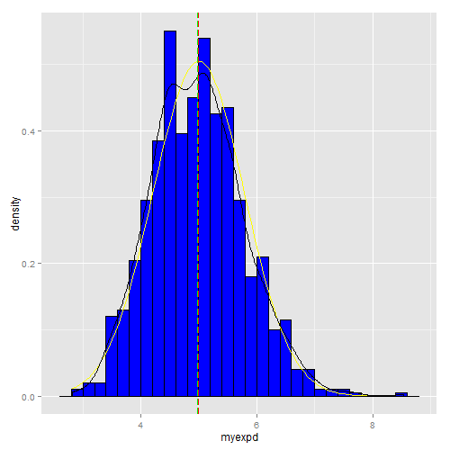
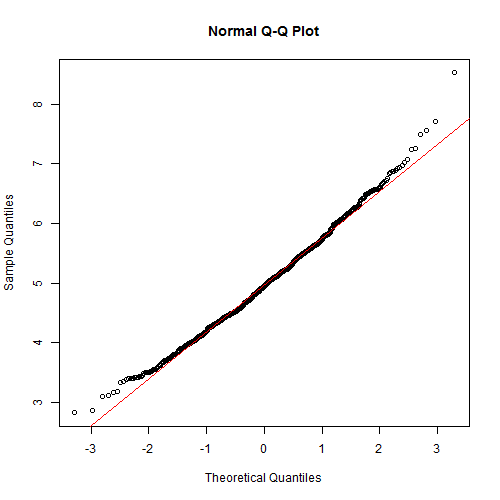

### Brief Introduction

This is the project report part 1 for the Online Coursera course -- Statistical Inference. Basic tasks of this project consists a simulation exercise.

The exponential distribution can be simulated in R with rexp(n, lambda) where lambda is the rate parameter. The mean of exponential distribution is 1/lambda and the standard deviation is also 1/lambda. 

For all of the thousand simulations, lambda should be set as 0.2. The distribution of averages of 40 exponentials should be investigated. 

### Simulation and Results

One thousand simulated averages of 40 exponentials can be realized via creation of an empty vector to store all of our sample means.


```r
lambda = 0.2
n = 40
myexpd <- rep(NA, 1000)
```

Thus, the distribution of the mean of 40 exponentials is simulated by,


```r
set.seed(512)
for (i in 1:1000){
    tmp <- rexp(n, lambda)
    myexpd[i] <- mean(tmp) 
}
```

The mean and variance can be obtained by


```r
myexpd_m <- mean(myexpd)
myexpd_m
```

```
## [1] 4.97779
```

```r
myexpd_v <- var(myexpd)
myexpd_v
```

```
## [1] 0.6250162
```

Compared to the theoretical mean and variance


```r
mean_t <- 1 / lambda
mean_t
```

```
## [1] 5
```

```r
var_t <- (1/lambda)^2/n
var_t
```

```
## [1] 0.625
```

As can be seen that the comparision between both the calculated mean/variance and the theoretical mean/variance featured with very small variation.

To see if the distribution resembles a normal distribution. The histogram plot can be examed, compared to normal distribution with theoretical mean and standard deviation.

Convert to format of data frame for ggplot.

```r
df <- data.frame(myexpd)
library(ggplot2)
```


```r
g <- ggplot(data=df, aes(x=myexpd)) 
g + geom_histogram(aes(y=..density..), fill="blue", binwidth=0.20, col="black") +
    stat_function(fun=dnorm, arg =list(mean=mean_t, sd=sqrt(var_t)), color="yellow") + 
    geom_density(col="black") + 
    geom_vline(xintercept=mean_t, col="red", linetype="longdash") + 
    geom_vline(xintercept=myexpd_m, col="green", linetype="longdash")
```

 

From the histogram plot, distribution of the simulation is approximately normal. Yellow curve represents normal distribution with theoretical mean (5) and variance (0.625). Black curve shows the density curve of the simulation. Red dashed line points out where the theoretical mean locates. Green dashed line shows where the calculated sample mean locates.

A better graphical way to tell whether the data is distributed normally or not is to resort to a so-called quantile-quantile (QQ) plot. The function qqnorm() can plot the target sample against a normal distribution. Besides, a function named qqline() can evaluate how much the deviation is from the normality. 


```r
qqnorm(myexpd)
qqline(myexpd, col = 2)
```

 
As clear seen from the QQ plot, the distribution of averages of 40 exponentials is pretty close to a normal distribution.

Last, evaluate the 95% confidence interval for this simulation:

```r
mean(df$myexpd) + c(-1,1)*1.96*sd(df$myexpd)/sqrt(nrow(df))
```

```
## [1] 4.928790 5.026791
```
